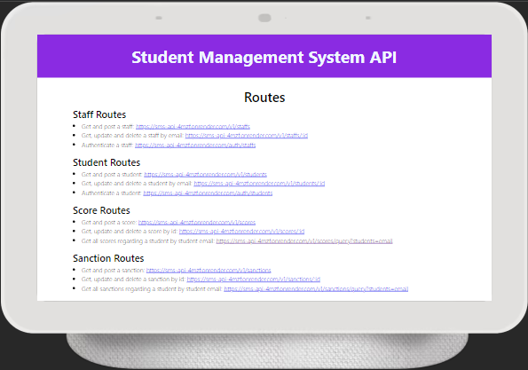

# Project Name
An advanced student management system is a specialized component of a broader school management system designed specifically to handle student data and information efficiently.


## Table of Contents
- Features
- Demo
- Technologies Used
- Installation
- Usage
- API Documentation (if applicable)
- Database Schema (if applicable)
- Screenshots
- Contributing
- License
- Acknowledgements

## Features
- Authentication system
- Authorization system
- Auto grading system

## Demo
- [Click here to view the client-side live](https://studentsmanagementsystem.netlify.app)
- [Click here to view the server-side live](https://sms-api-4mzf.onrender.com)

## Technologies Used
### Client side technologies
- Vite: Build tool and development server for modern web applications
- ReactJS: JavaScript library for building user interfaces
- HTML: Basic structure for creating interactive and visually appealing websites
- CSS: Stylesheet language used for describing the presentation and formatting of a document written in HTML
- Axios: HTTP requests handler widely used due to its simplicity, flexibility, and robust features
- JWT decode: Lightweight library specifically designed for decoding JWT tokens in the browser
- React icons: Set of high-quality, customizable icons for use in React applications
- React toastify: Simple and customizable way to show user-friendly messages, warnings, or feedback to users without interrupting their workflow

### Server side technologies
- Express: Minimal and flexible Node.js web application framework that provides a robust set of features to develop web and mobile applications
- MongoDB: Open-source NoSQL database management system that stores data in JSON-like format, known as Binary JSON
- Mongoose: Object Data Modeling library for MongoDB and Node.js applications, provides a powerful and flexible framework for interacting with MongoDB databases
- Bcryptjs: Securely store passwords in databases, enhancing the overall security of their applications
- CORS: Security feature implemented by web browsers that controls how web pages in one domain can request and interact with resources hosted on another domain
- Helmet: Security middleware for Express.js, a popular Node.js web application framework
- Jsonwebtoken: Compact, URL-safe token format used for securely transmitting information between parties

## Installation
```
# Clone the repository
git clone https://github.com/PhilipOyelegbin/sms.git

# Change directory for frontend
cd client

# Change directory for backend
cd server

# Install dependencies
npm install
```

## Usage
- Create an environmental variable containing the database details, port and the routes for the API
```
# Start the development server
npm start
```

## API Documentation
[If your project includes an API, provide documentation here. Include endpoints, request methods, parameters, and example responses.]

## Database Schema
[If your project uses a database, provide the schema structure and relationships here.]

## Screenshots



## Contributing
You can contribute to this project by updating the grading system in the server side to dynamically be able to only extract the score of the subjects, calculate the average and also assign a grade. The current stage of the project can only take specific set of students due to the auto grading system limitation.

## License
- N/A

## Acknowledgements
- Chat GPT
- Various tools documentations